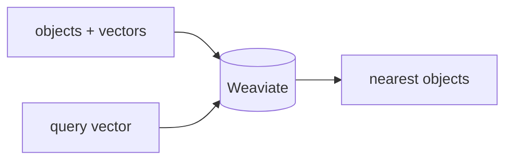

## 개요

Weaviate는 하이브리드(벡터+키워드) 검색, 정형 필터링, 그리고 데이터를 대신 임베딩해주는 선택적 벡터라이저 모듈을 갖춘 오픈소스 벡터 데이터베이스입니다.  
Docker로 셀프호스트하거나 매니지드 Weaviate Cloud로 운영하며, RAG와 에이전트의 검색 계층으로 흔히 쓰입니다.

**코드 샘플** 탭에서 벡터 직접 관리 흐름을 보여줍니다.

## 언제 쓰면 좋은가

하이브리드 검색과 풍부한 필터링을 한 엔진에서, 내장 벡터라이저 옵션과 함께 원할 때 —
셀프호스트든 Weaviate Cloud든 Weaviate를 고르세요.
